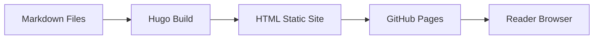

# Design Document: GenAI Developer Exam Guide Workshop

## Overview

Workshop hướng dẫn ôn thi AWS Certified Generative AI Developer - Professional (AIP-C01) được xây dựng trên nền tảng Hugo site bilingual (Tiếng Việt / English) theo format First Cloud Journey (FCJ). Nội dung bao gồm phân tích chi tiết 5 Content Domains của kỳ thi, hands-on labs thực hành với AWS services, tài liệu tham khảo, và chiến lược ôn thi.

Đây là một dự án content-only — không có application code, không có backend, không có logic xử lý. Toàn bộ output là các file markdown được Hugo render thành static site.

## Architecture

### Content Structure

Workshop sử dụng cấu trúc thư mục Hugo bilingual hiện có, mở rộng từ template gốc:

```
content/
├── vi/                                    # Tiếng Việt
│   ├── _index.md                          # Landing page
│   ├── 1-introduction/
│   │   ├── _index.md                      # Chapter: Giới thiệu kỳ thi AIP-C01
│   │   ├── 1.1-exam-overview/
│   │   │   └── _index.md                  # Tổng quan kỳ thi
│   │   ├── 1.2-target-candidate/
│   │   │   └── _index.md                  # Đối tượng & yêu cầu
│   │   └── 1.3-content-domains-overview/
│   │       └── _index.md                  # Tổng quan 5 domains + weightings
│   ├── 2-preparation/
│   │   ├── _index.md                      # Chapter: Chuẩn bị
│   │   ├── 2.1-aws-account-setup/
│   │   │   └── _index.md                  # Tạo AWS account, IAM user
│   │   └── 2.2-enable-bedrock/
│   │       └── _index.md                  # Enable Amazon Bedrock model access
│   ├── 3-content-domains/
│   │   ├── _index.md                      # Chapter: Chi tiết Content Domains
│   │   ├── 3.1-domain1-fm-integration/
│   │   │   └── _index.md                  # Domain 1: FM Integration (31%)
│   │   ├── 3.2-domain2-implementation/
│   │   │   └── _index.md                  # Domain 2: Implementation (26%)
│   │   ├── 3.3-domain3-safety-security/
│   │   │   └── _index.md                  # Domain 3: AI Safety (20%)
│   │   ├── 3.4-domain4-optimization/
│   │   │   └── _index.md                  # Domain 4: Optimization (12%)
│   │   └── 3.5-domain5-testing/
│   │       └── _index.md                  # Domain 5: Testing (11%)
│   ├── 4-hands-on-labs/
│   │   ├── _index.md                      # Chapter: Hands-on Labs
│   │   ├── 4.1-invoke-fm-bedrock/
│   │   │   └── _index.md                  # Lab 1: Invoke FM via Bedrock
│   │   ├── 4.2-build-rag-pipeline/
│   │   │   └── _index.md                  # Lab 2: Build RAG with Knowledge Bases
│   │   ├── 4.3-implement-guardrails/
│   │   │   └── _index.md                  # Lab 3: Bedrock Guardrails
│   │   ├── 4.4-agentic-workflow/
│   │   │   └── _index.md                  # Lab 4: Agentic AI workflow
│   │   └── 4.5-monitoring-genai/
│   │       └── _index.md                  # Lab 5: Monitoring with CloudWatch
│   ├── 5-references/
│   │   ├── _index.md                      # Chapter: Tài liệu tham khảo
│   │   ├── 5.1-in-scope-services/
│   │   │   └── _index.md                  # AWS services in-scope
│   │   ├── 5.2-out-of-scope-services/
│   │   │   └── _index.md                  # AWS services out-of-scope
│   │   └── 5.3-study-resources/
│   │       └── _index.md                  # Blog posts, whitepapers, courses
│   ├── 6-cleanup/
│   │   └── _index.md                      # Chapter: Dọn dẹp tài nguyên
│   └── 7-summary/
│       └── _index.md                      # Chapter: Tổng kết & chiến lược thi
├── en/                                    # English (mirror structure)
│   └── ... (same structure as vi/)
```

### Page Rendering Flow



## Components and Interfaces

Vì đây là dự án content-only, "components" ở đây là các loại trang markdown:

### 1. Chapter Pages (`_index.md` với `chapter: true`)
- Dùng cho các section chính (1-introduction, 2-preparation, etc.)
- Front matter bao gồm: title, date, weight, chapter, pre
- Chứa mô tả ngắn và `{}` shortcode

### 2. Content Pages (`_index.md` không có `chapter: true`)
- Dùng cho các sub-section (3.1-domain1, 4.1-invoke-fm, etc.)
- Front matter bao gồm: title, date, weight
- Chứa nội dung chi tiết

### 3. Landing Page (`_index.md` ở root)
- Trang chủ workshop với overview table và children links

### Content Page Template Pattern

Mỗi Content Domain page tuân theo cấu trúc:
1. Tiêu đề domain + weighting percentage
2. Mô tả tổng quan domain
3. Từng Task với heading H3
4. Từng Skill với heading H4, giải thích chi tiết, AWS services liên quan
5. Notice shortcodes cho exam tips
6. References section với links tới AWS docs/blogs

Mỗi Hands-on Lab page tuân theo cấu trúc:
1. Objective + prerequisites + estimated duration
2. Architecture diagram (nếu có)
3. Step-by-step instructions với numbered list
4. Code snippets (AWS CLI, Python SDK)
5. Screenshots/diagrams tại các bước quan trọng
6. Verification steps
7. Notice shortcodes cho tips và warnings

## Data Models

Không có data models vì đây là static content site. "Data" là nội dung markdown được Hugo render.

### Hugo Front Matter Schema

Chapter page:
```yaml
---
title: "Section Title"
date: 2025-01-01
weight: N
chapter: true
pre: "<b>N. </b>"
---
```

Content page:
```yaml
---
title: "N.N Page Title"
date: 2025-01-01
weight: N
---
```


## Correctness Properties

*A property is a characteristic or behavior that should hold true across all valid executions of a system-essentially, a formal statement about what the system should do. Properties serve as the bridge between human-readable specifications and machine-verifiable correctness guarantees.*

Vì đây là dự án content-only (static Hugo site), phần lớn acceptance criteria liên quan đến nội dung text không thể kiểm tra tự động. Tuy nhiên, các thuộc tính cấu trúc (structural properties) của file system và Hugo front matter có thể được kiểm chứng.

Property 1: Bilingual file parity
*For any* markdown file in content/vi/, there exists a corresponding file at the same relative path in content/en/, and both files have identical `weight` values in their Hugo front matter.
**Validates: Requirements 6.1, 6.2**

Property 2: Hugo front matter completeness
*For any* markdown content file in the workshop, the file contains valid Hugo front matter with at minimum `title`, `date`, and `weight` fields. Additionally, for any chapter-level page (top-level section `_index.md`), the front matter contains `chapter: true` and a `pre` field matching the pattern `<b>N. </b>`.
**Validates: Requirements 7.1, 7.2**

Property 3: Chapter pages contain children shortcode
*For any* chapter-level `_index.md` page (with `chapter: true`), the page body contains the `{}` Hugo shortcode.
**Validates: Requirements 7.3**

Property 4: Directory naming convention
*For any* content directory under content/vi/ or content/en/, the directory name matches the pattern `N-kebab-case-name` or `N.N-kebab-case-name`, and contains an `_index.md` file.
**Validates: Requirements 7.4**

## Error Handling

Không áp dụng — đây là static content site. Không có runtime errors. Lỗi duy nhất có thể xảy ra là Hugo build failure do:
- Front matter YAML syntax không hợp lệ
- Shortcode sử dụng sai cú pháp
- Tham chiếu hình ảnh không tồn tại

Các lỗi này được phát hiện khi chạy `hugo server` hoặc `hugo build`.

## Testing Strategy

### Dual Testing Approach

#### Property-Based Tests
- Sử dụng **Node.js** với thư viện **fast-check** để viết property-based tests
- Tests đọc file system và validate cấu trúc markdown files
- Mỗi property test chạy tối thiểu 100 iterations (tuy nhiên với file system tests, iterations sẽ dựa trên số lượng files thực tế)
- Mỗi test được annotate với comment: `**Feature: genai-developer-exam-guide, Property {number}: {property_text}**`
- Mỗi correctness property được implement bởi một property-based test duy nhất

#### Unit Tests
- Validate Hugo build thành công bằng cách chạy `hugo --minify` và kiểm tra exit code
- Spot-check một số file cụ thể cho content completeness

### Test Framework
- **fast-check** (npm package) cho property-based testing
- **vitest** cho test runner
- Tests nằm trong thư mục `tests/` ở root project

### Test Execution
- Chạy tests: `npx vitest --run`
- Tests validate cấu trúc files, không validate nội dung text (nội dung được review thủ công)
